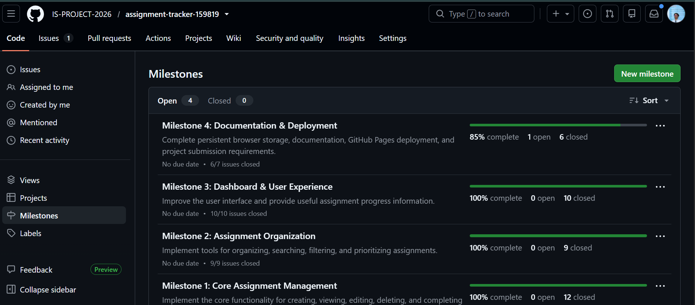
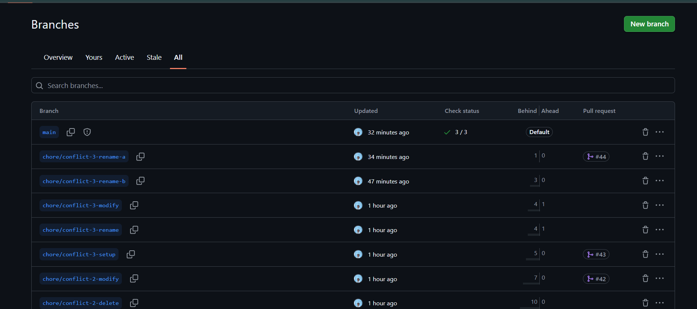
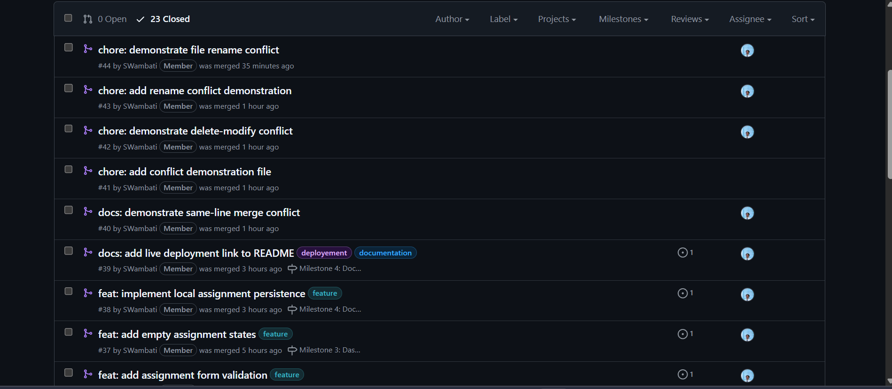
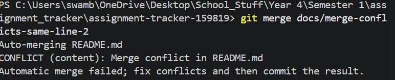
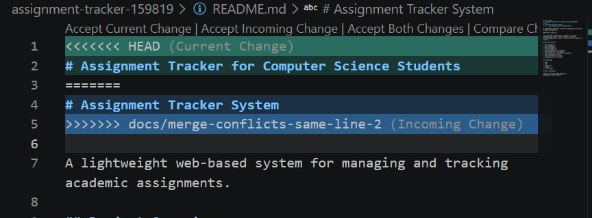
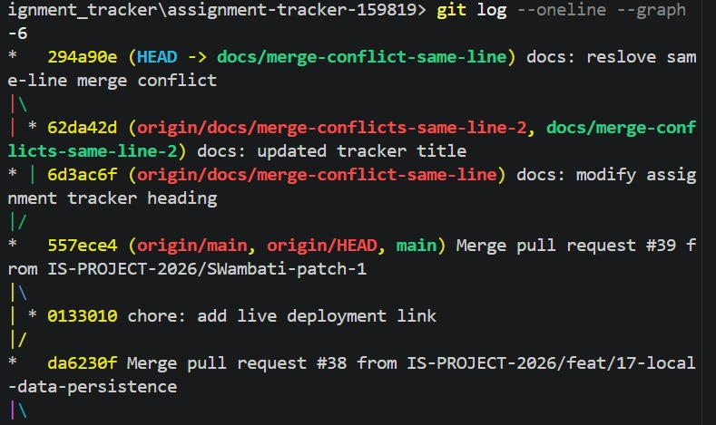
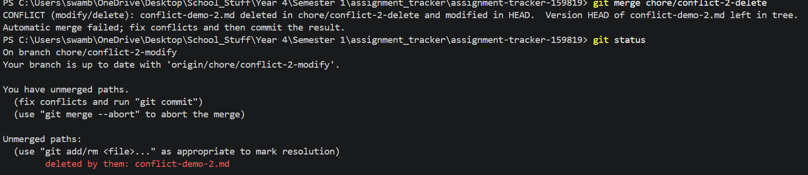
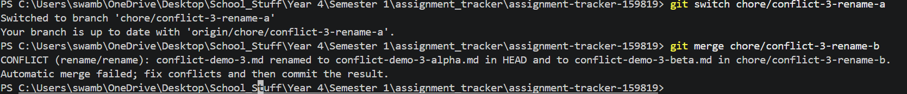

# Project Submission Report

## 1. Student Details

- **Full Name:** Wambati, Sylvia Wavinya
- **GitHub Username:** @SWambati
- **Email:** sylvia.wambati@strathmore.edu

## 2. Deployed Project Link

 https://is-project-2026.github.io/assignment-tracker-159819/

## 3. Reflection — Grounded in Git History

### A. Your Best Commit

- **Commit URL:** (https://github.com/IS-PROJECT-2026/assignment-tracker-159819/commit/185a7097bc789dd0dc28f28e350f7cc9b6685ee9)

- **Why this one?**

I chose this commit because it clearly follows the Conventional Commits format and the message immediately explains what was changed and why. This commit (refactor) was combining search and filter features.

### B. A Mistake or Struggle

- **Link to the evidence:** (https://github.com/IS-PROJECT-2026/assignment-tracker-159819/pull/44)

- **What happened and how did you recover?**

One of the biggest struggles during the project was creating and resolving a file rename merge conflict.I initially created the branches in a way that caused the changes to end up on the wrong branch, thus Git reported that the branches were already up to date instead of producing the conflict I expected.

I checked the branch history and differences, identified what had happened and recreated the conflict using two independent branches. This eventually produced a file rename conflict that was captured and resolved successfully. 

### C. A Pull Request You're Proud Of

- **PR URL:** https://github.com/IS-PROJECT-2026/assignment-tracker-159819/pull/23

- **What did you check before merging?**

Before merging, I checked that the PR was targeting the correct base branch and the changes matched the issue being addressed

### D. One Thing You Would Do Differently

- **What would you change?**

If I restarted the project, I would plan the conflict/evidence workflow earlier instead of leaving the required merge conflicts until near the end of the assignment. The conflicts were eventually completed successfully, but doing them earlier would have given me more time to organize the evidence and would have reduced the pressure during the final stages.

- **Link to the evidence of the original decision:** https://github.com/IS-PROJECT-2026/assignment-tracker-159819/tree/chore/merge-conflict-delete-modify

## 4. Screenshots of Key GitHub Features

### A. Milestones and Issues

* **Caption:** The project was divided into milestones containing issues. Each issue represented a specific functionality or project management task for easier tracking.

### C. Branching Architecture

* **Caption:** The project used issue-oriented branch names such as feat/, style/, chore/, etc. This made the purpose of each branch clear and kept individual changes isolated from the main branch.'

### D. Pull Requests & Traceability

* **Caption:** Development changes were submitted through pull requests and linked back to their corresponding issues, providing traceability from the original requirement to the implementation and eventual merge into main branch.

## 5. Merge Conflict Evidence

### Conflict 1 — Full Chronology

**What cause did you use?**

Same Line Editing

### Step 1: Generating the Clash

* **Caption:** The two branches `docs/merge-conflicts-same-line-1` and `docs/ merge-conflicts-same-line-2` were created from the same version of the README. Each branch changed the same line in a different way. When `docs/merge-conflicts-same-line-2` was merged into `docs/merge-conflicts-same-line-1`, Git could not automatically determine which version of the line should be kept and reported a content conflict.

### Step 2: Inside the Code Editor (Conflict Markers)

* **Caption:** The README showed Git's unresolved conflict markers, including `<<<<<<< HEAD`, `=======`, and `>>>>>>> docs/merge-conflicts-same-line-2`. The two competing versions were reviewed and replaced with a single final version before the file was staged.

### Step 3: Resolution & Clean Merge

* **Caption:** After resolving the conflicting line, the README was staged and the merge was completed successfully. The resolved branch was then pushed through the normal pull-request workflow and merged into `main`.

### Conflict 2 — Different Cause

**What cause did you use?**

Delete vs Modify

**Why does this cause trigger a conflict?**

This conflict occurs when one branch modifies a file while another branch deletes the same file. Git cannot automatically decide whether the changes should be preserved or whether the deletion should take priority, so it reports a modify/delete conflict that has to be resolved manually.

* **Caption:** The branch `chore/conflict-2-modify` modified `conflict-demo-2.md`, while `chore/conflict-2-delete` deleted the same file. Git reported a modify/delete conflict when the branches were merged. The deletion was selected as the final resolution because the file existed only for the conflict demonstration.

### Conflict 3 — Different Cause

**What cause did you use?**

File Renames

**Why does this cause trigger a conflict?**

This conflict occurs when the same file is renamed differently on two branches. Git cannot automatically choose which destination filename should be used, so it reports a rename/rename conflict and requires the developer to select the desired final path.

* **Caption:** The branch `chore/conflict-3-rename-a` renamed `conflict-demo-3.md` to `conflict-demo-3-alpha.md`, while `chore/conflict-3-rename-b` renamed the same file to `conflict-demo-3-beta.md`. Git reported a rename/rename conflict, which was resolved by keeping `conflict-demo-3-alpha.md` as the final filename.

